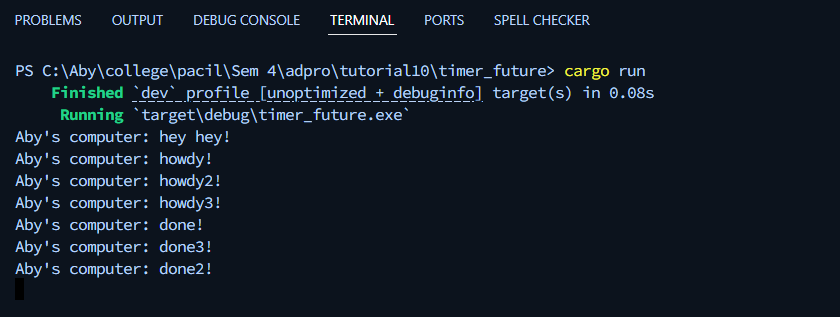

# Tutorial 10 - Asynchronous Programming - Timer
**Emanuella Abygail - 2306152185**

## Understanding How It Works

Program asynchronous menjalankan fungsi async di latar belakang tanpa menghentikan eksekusi thread utama. Artinya, thread utama akan langsung lanjut menjalankan kode berikutnya tanpa menunggu fungsi async selesai. Fungsi async yang telah dipanggil akan dieksekusi bersamaan dengan progran utama sesuai dengan urutan pemanggilannya. Itulah sebabnya teks "hey hey" muncul lebih dulu, kemudianh "howdy" dan setelah 2 detik "done". Sementara itu, perintah `drop(spawner);` menandakan bahwa tidak akan ada lagi task baru yang ditambahkan, sehingga executor tahu bahwa ia bisa menyelesaikan seluruh tugas yang tersisa dan kemudian berhenti.

## Multiple Spawn and Removing Drop

Ada banyak spawn sehingga program mencetak banyak howdy dan done. done3 diprint sebelum done2 padahal pada program ditulis sebaliknya. Hal ini terjadi karena semua spawn berjalan secara async atau berjalan secara paralel dan bersamaan sehingga saat selesai bisa saja urutannya berbeda. Jika tidak ada `drop(spawner)`, program tidak akan tahu bahwa program sudah selesai dan akan menunggu terus-menerus.